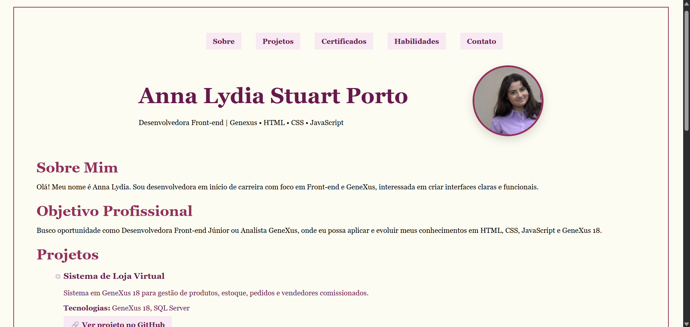
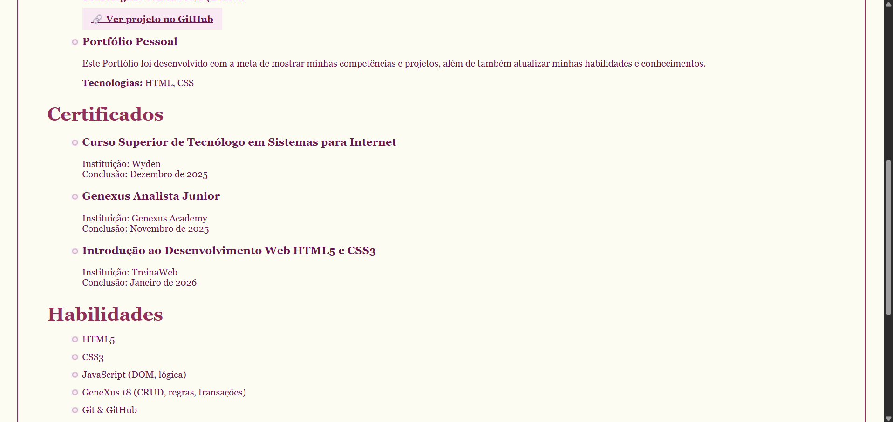
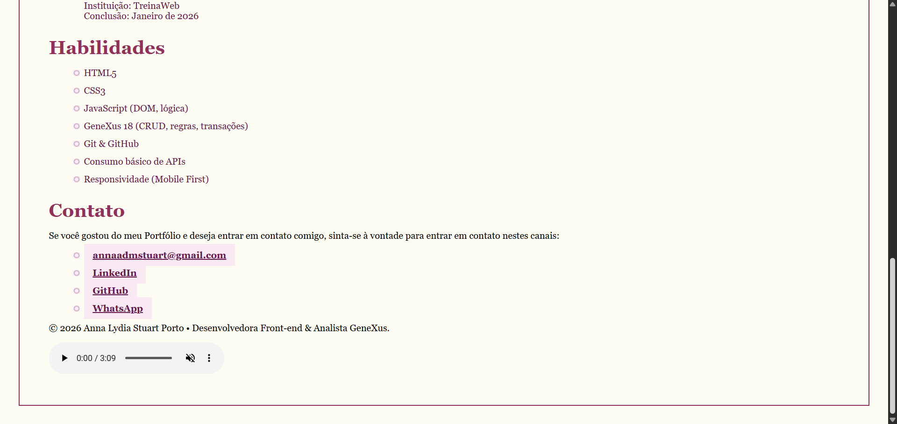

# Portfólio Web

Este projeto consiste em um site de portfólio desenvolvido com HTML5 e CSS3 para apresentar meus projetos e habilidades na área de tecnologia.

## Tecnologias utilizadas

- HTML5
- CSS3

## Objetivo

Apresentar projetos desenvolvidos durante minha formação em Sistemas para Internet e demonstrar conhecimentos em desenvolvimento web.

## Funcionalidades

- Apresentação profissional
- Seção de projetos
- Informações de contato
## 📷 Demonstração do Portifólio

